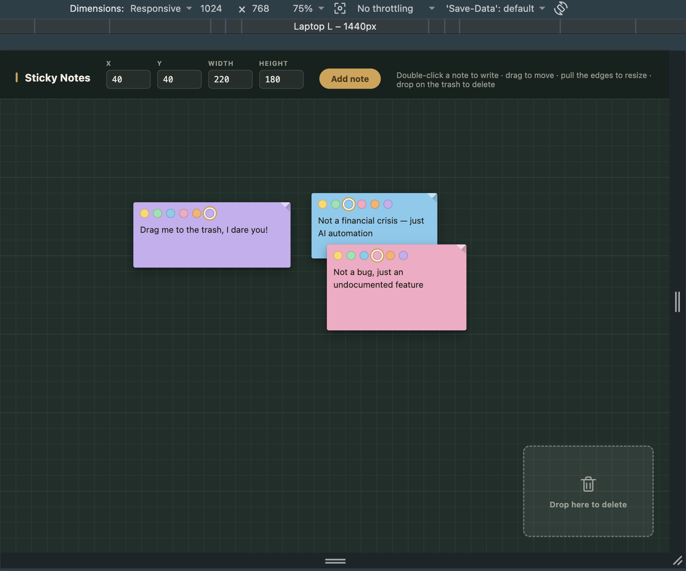

# Sticky Notes

A single-page sticky notes app built with React, TypeScript, and Vite.

## Setup

```bash
npm install
npm run dev
```

Open the printed URL (default http://localhost:5173) in a desktop browser.

## Features

**Required**

- Create a note of a specified size at a specified position
- Move a note by dragging
- Resize a note by dragging any edge or corner
- Delete a note by dropping it on the trash zone

**Bonus**

- Inline text editing (double-click a note to write)
- Bring a note to front (click to reorder overlapping notes)
- Different note colors
- Persisted to `localStorage` and restored on page load
- Saved through a mocked async REST layer

See [ARCHITECTURE.md](./ARCHITECTURE.md) for design details.

## Preview


